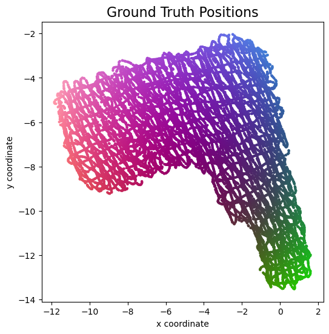
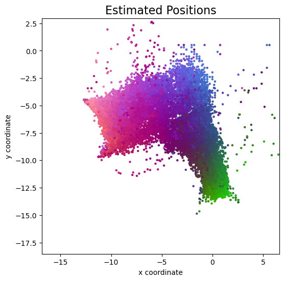
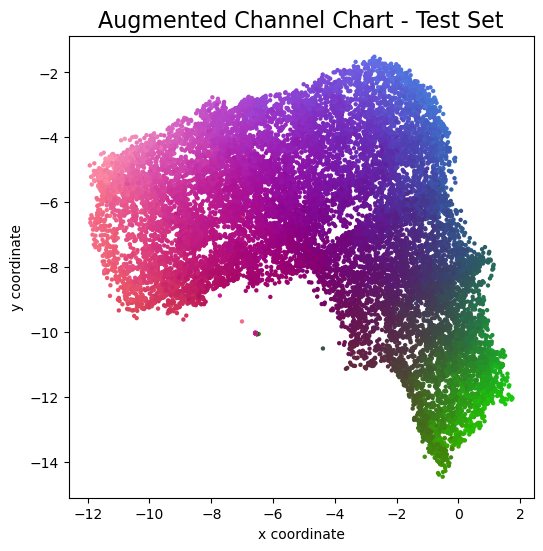
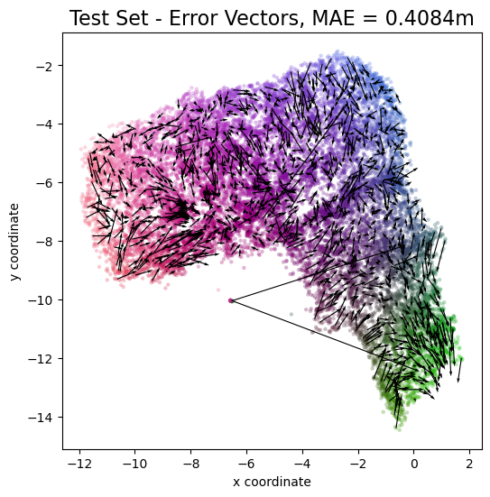
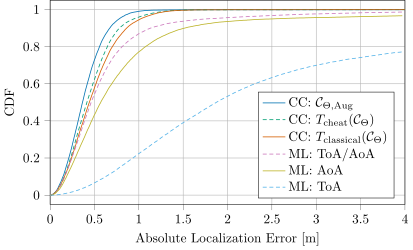

# Augmenting Channel Charting with Classical Wireless Source Localization Techniques

This repository contains the source code for the paper

> Florian Euchner, Phillip Stephan, Stephan ten Brink: "Augmenting Channel Charting with Classical Wireless Source Localization Techniques"

presented at the Asilomar Conference on Signals, Systems, and Computers in November 2023.


In that paper, we show how to combine [Dissimilarity Metric-Based Channel Charting](https://dichasus.inue.uni-stuttgart.de/tutorials/tutorial/dissimilarity-metric-channelcharting/) with classical source localization techniques (angle of arrival + triangulation, time of arrival + trilateration) to generate very accurate transmitter position estimates purely from channel state information (CSI) available at a massive MIMO base station.
We use the [dichasus-cf0x CSI dataset](https://dichasus.inue.uni-stuttgart.de/datasets/data/dichasus-cf0x/) measured by [DICHASUS](https://dichasus.inue.uni-stuttgart.de/).

### Results
Here are some of the main findings from the paper:

Reference Positions (Tachymeter) | Classical: AoA / ToA Joint Estimation
:-:|:-:
 | 


Classical-Augmented Channel Chart | Channel Chart - Error Vectors
:-:|:-:
 | 




In summary, both classical and Channel Charting-based localization algorithms are capable of producing good transmitter position estimates.
Channel Charting produces much more accurate estimates, however.

The CDF plot shows the following curves, from least accurate (lowest) to most accurate (highest):
* Maximum Likelihood (ML) position estimation based on Time of Arrival (ToA) information
* Maximum Likelihood (ML) position estimation based on Angle of Arrival (AoA) information
* Maximum Likelihood (ML) position estimation, jointly based on Time of Arrival (ToA) and Angle of Arrival (AoA) information. *This is what is implemented in this repository in `4_ClassicalLocalization.ipynb`.*
* Channel Charting (CC) with application of affine transform from Channel Chart coordinates to physical space coordinates. The affine transform was estimated using classical (ML with joint AoA+ToA) position estimates.
* Channel Charting (CC) with application of affine transform from Channel Chart coordinates to physical space coordinates. The affine transform was estimated using ground truth positions, which effectively amounts to "cheating".
* Channel Charting (CC), with loss function augmented by classical likelihood function. *This is what is implemented in this repository in `6_AugmentedChannelCharting.ipynb`.*

### Prerequesites
Our code is based on Python, TensorFlow, NumPy, SciPy and Matplotlib.
Source files are provided as Jupyter Notebooks, which can be opened directly here on GitHub or using e.g. [https://jupyter.org/](JupyterLab).

We run our Channel Charting experiments on a JupyterHub server with NVMe storage, AMD EPYC 7262 8-Core Processor, 64GB RAM, and a NVIDIA GeForce RTX 4080 GPU for accelerating TensorFlow.
All indications of computation times are measured on this system.
It should also be possible to run our notebooks on less performant systems.

### Notebooks - Training Procedure
The Jupyter Notebooks in this repository are numbered.
You must execute them in the right order.
In the `results` directory, this repository contains the intermediate results of steps 1, 2, 3 and 4 (delay spread estimation, ToA estimation, AoA estimation, classical localization). You may choose to skip these steps, but you must perform steps 0 and 5 (download dataset, compute dissimilarity matrix) to learn a channel chart in step 6.

* `0_DownloadDatasets.ipynb`: Download parts of the [dichasus-cf0x](https://dichasus.inue.uni-stuttgart.de/datasets/data/dichasus-cf0x/) dataset that we use for training and testing. Due to the large file size, this dataset is not included in this git repository.
* `1_DelaySpread.ipynb`: Estimate RMS delay spreads for the CSI in the dataset. The observed delay spread at a certain receiver antenna array is a good indication of how line-of-sight-like the channel between transmitter and the antenna array is. This will help judge the quality of ToA / AoA estimates. This step should only take a few seconds.
* `2_ToA_Estimation.ipynb`: Perform time of arrival estimation using the MUSIC algorithm. The ToA estimates are used for multilateration-based positioning, but also for extracting the LoS component during AoA estimation. This step will take a very long time (more than 24 hours on our server), but I'm confident there are ways to greatly optimize it.
* `3_AoA_Estimation.ipynb`: Perform angle of arrival estimation using the MUSIC algorithm. This step should only take a few seconds.
* `4_ClassicalLocalization.ipynb`: Estimate the transmitter position using classical triangulation / multilateration. The code maximizes a joint AoA+ToA-based likelihood function. By making use of Python's multiprocessing, this step should only take a few seconds to a few minutes on a sufficiently fast machine.
* `5_DissimilarityMatrix.ipynb`: Compute the fused dissimilarity matrix (angle delay profile + timestamp-based, learn more about this in [our tutorial](https://dichasus.inue.uni-stuttgart.de/tutorials/tutorial/dissimilarity-metric-channelcharting/)). This dissimilarity matrix is the most important ingredient to dissimilarity metric-based Channel Charting. This step should take a few seconds to a few minutes.
* `6_AugmentedChannelCharting.ipynb`: Train the neural network that implements the forward charting function, with a loss function that uses both the previously computed dissimilarity matrix as well as the computed AoA / ToA estimates. Training is based on a Siamese neural network. With GPU acceleration, this should take between a few seconds to a few minutes.
* `VisualizationVideo.ipynb`: Optional, generates videos that visualize classical TDoA / AoA estimation. Requires ToA / AoA estimates and delay spreads.

### Citation
```
@inproceedings{euchner2023augmenting,
	author    = {Euchner, Florian and Stephan, Phillip and ten Brink, Stephan},
	title     = {{Augmenting Channel Charting with Classical Wireless Source Localization Techniques}},
	booktitle = {Asilomar Conference on Signals, Systems, and Computers},
	year      = {2023}
}
```

### Other Resources
* [Christoph Studer's Channel Charting Website](https://channelcharting.github.io/)
* [DICHASUS Website](https://dichasus.inue.uni-stuttgart.de/)
* [Our tutorial on dissimilarity metric-based Channel Charting](https://dichasus.inue.uni-stuttgart.de/tutorials/tutorial/dissimilarity-metric-channelcharting/)
* [Our paper on dissimilarity metric-based Channel Charting](https://arxiv.org/abs/2308.09539)
* [Good classic paper on ToA estimation](https://ieeexplore.ieee.org/stamp/stamp.jsp?arnumber=1259415)
* [Good recent paper on joint ToA / AoA-based localization](https://arxiv.org/pdf/2207.08512.pdf)